# Electric Dark Themes 🔮

> Experience the thrill of browsing the internet in style

This is a dark theme with multiple color schemes for both Firefox and Chrome. It's perfect for users who prefer a sleek, modern look for their browsing experience.

## How to install

Install the theme from the respective Firefox Addons page (click on an image) or from [my Firefox Addons profile](https://addons.mozilla.org/en-US/firefox/user/17592504/):

[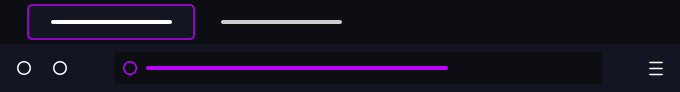](https://addons.mozilla.org/en-US/firefox/addon/electric-purple-dark/)

[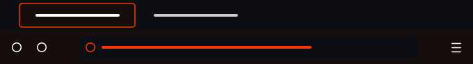](https://addons.mozilla.org/en-US/firefox/addon/electric-orange-dark/)

[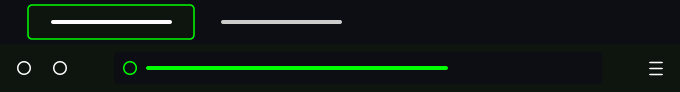](https://addons.mozilla.org/en-US/firefox/addon/electric-green-dark/)

[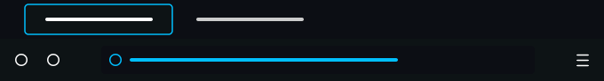](https://addons.mozilla.org/en-US/firefox/addon/electric-azure-dark/)

[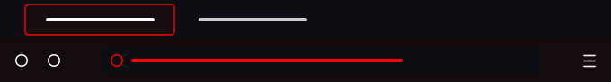](https://addons.mozilla.org/en-US/firefox/addon/electric-red-dark/)

[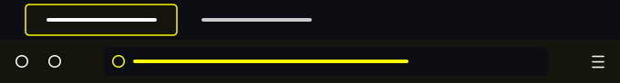](https://addons.mozilla.org/en-US/firefox/addon/electric-yellow-dark/)

[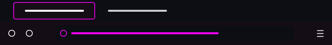](https://addons.mozilla.org/en-US/firefox/addon/electric-pink-dark/)

[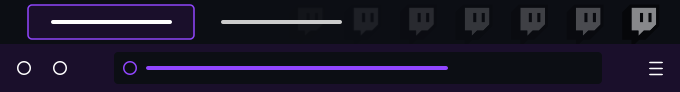](https://addons.mozilla.org/en-US/firefox/addon/electric-twitch-dark/)

[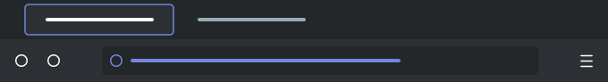](https://addons.mozilla.org/en-US/firefox/addon/electric-discord-dark/)

[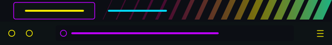](https://addons.mozilla.org/en-US/firefox/addon/electric-cyberpunk-dark/)

[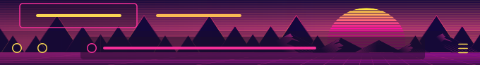](https://addons.mozilla.org/en-US/firefox/addon/electric-vaporwave-dark/)

[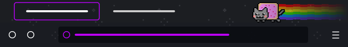](https://addons.mozilla.org/en-US/firefox/addon/nyan-cat-purple-dark/)

[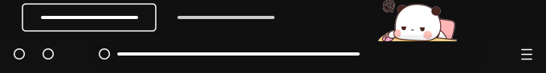](https://addons.mozilla.org/en-US/firefox/addon/bubu-panda-dark/)

## How to build from source

The dependencies used in the code are all part of the Python Standard Library and do not need to be installed manually as they are included with a standard installation of Python.

- Run the Python script to generate the extension packages for Firefox and Chrome (should also work on other Chromium-based browsers)

## Features

This theme comes with the following features:

- Dark color scheme for a comfortable browsing experience in low light environments
- Custom color scheme with electric accents for a pop of color
- Stylish tab line with electric color to easily identify the active tab
- Utilizes templates to produce a Chrome and Firefox theme using the same color scheme

## Contributing

Please submit an issue and provide thorough details if you discover any flaws or have any recommendations for enhancements. Pull requests are also welcomed.

## Disclaimer

The themes named “Twitch” and “Discord” are not affiliated with, endorsed by, or sponsored by Twitch Interactive, Inc. or Discord, Inc. respectively. The themes are intended for personal use only. The use of the names “Twitch” and “Discord” are for descriptive purposes only and do not imply any association with the official brands or services.
